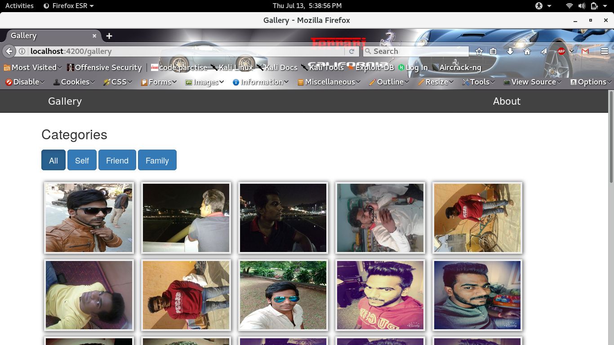

# Gallery

This project was generated with [Angular CLI](https://github.com/angular/angular-cli) version 1.1.1.

#### AUTHOR:

- [Chandramohan Jagtap](https://github.com/cmjagtap "Chandramohan's github profile")

#### DESCRIPTION:

This is my first Angularjs Application. I have try to impliment Image Gallery.
Technology used `Angular cli`(Angular 4) and Languages `HTML`,`CSS`,`TYPESCRIPT`.

#### Requirment:
	- You must have npm module intall.
	- nodejs v6+.
	- Angular cli

#### Runing Application:
	
	- You have to create Application using npm module .
	- copy node_modules folder and paste it into root directory of Application.
	- Type `ng serve` in terminal and open brower on `localhost:4200`.
	- 4200 default port of angularjs. 
